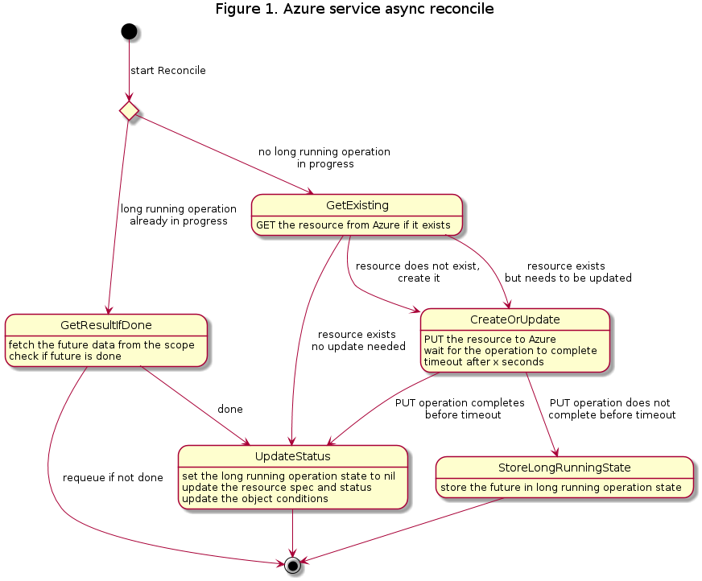
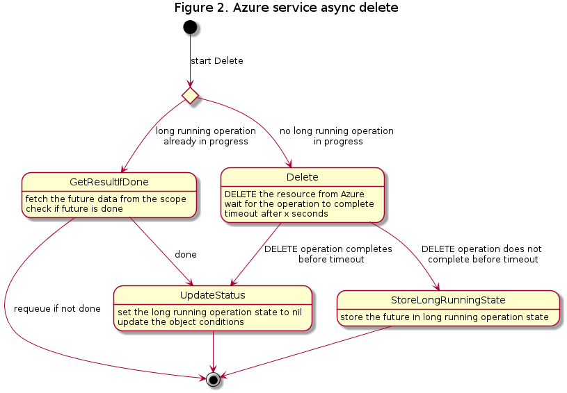

# Async Azure Resource Creation and Deletion

## <a name='TableofContents'></a>Table of Contents

<!-- vscode-markdown-toc -->
* [Table of Contents](#TableofContents)
* [Summary](#Summary)
* [Motivation](#Motivation)
	* [Goals](#Goals)
	* [Non-Goals / Future Work](#Non-GoalsFutureWork)
* [Proposal](#Proposal)
	* [User Stories](#UserStories)
		* [Story 1 - UX of creating an AzureCluster](#Story1-UXofcreatinganAzureCluster)
		* [Story 2 - Scaling up a MachineDeployment](#Story2-ScalingupaMachineDeployment)
		* [Story 3 - Deleting an individual Azure Machine Pool Machine](#Story3-DeletinganindividualAzureMachinePoolMachine)
	* [Implementation Details/Notes/Constraints](#ImplementationDetailsNotesConstraints)
		* [Proposed API Changes](#ProposedAPIChanges)
		* [Proposed Controller Changes](#ProposedControllerChanges)
* [Alternatives](#Alternatives)
	* [Parallel reconciliation of Azure services](#ParallelreconciliationofAzureservices)
		* [Pros](#Pros)
		* [Cons](#Cons)
		* [Conclusion](#Conclusion)
* [Additional Details](#AdditionalDetails)
	* [Test Plan](#TestPlan)
* [Implementation History](#ImplementationHistory)

<!-- vscode-markdown-toc-config
	numbering=false
	autoSave=false
	/vscode-markdown-toc-config -->
<!-- /vscode-markdown-toc -->

## <a name='Summary'></a>Summary

CAPZ reconcilers currently call Azure and wait for each operation before proceeding. We should create/update/delete Azure resources asynchronously, especially for operations that take a long time to complete, such as Virtual Machine creation and deletion.

## <a name='Motivation'></a>Motivation

Blocking on success is sometimes the right thing to do but most of the time, it's the equivalent of the UI freezing on an app because you have used the UI thread to fetch some data causing your user to wonder why and when the software will react. This proposal aims to make the reaction time of the CAPZ controller drastically faster and possibly, more resilient.

### <a name='Goals'></a>Goals

- Accelerate the feedback loop with the user so they can know that reconciliation is progressing without having to go check the Azure resources in the portal/CLI/etc.
- Make the time for the controller to react to a change much faster
- Improve the resiliency of the controller by making it more fault tolerant
- Make it easier for the user to understand the state of each resource by adding more granular Conditions
- Apply the same asynchronous pattern to all resources

### <a name='Non-GoalsFutureWork'></a>Non-Goals / Future Work

- Increase or decrease overall duration of reconciliation
- Increase the number of API calls to Azure
- Start Azure operations in parallel
- Predict how long each operation will take
- Apply the same changes to the managed cluster (AKS) reconciler

## <a name='Proposal'></a>Proposal

### <a name='UserStories'></a>User Stories

#### <a name='Story1-UXofcreatinganAzureCluster'></a>Story 1 - UX of creating an AzureCluster

Blake is a Program Manager trying out Cluster API for the first time. Blake is following the quickstart documentation in the Cluster API book and using Azure to create a cluster. Blake applies the cluster template on the management cluster and describes the resulting AzureCluster resource. The AzureCluster is in "Creating" state and the Conditions get updated as Azure resources are created to show the progress.

#### <a name='Story2-ScalingupaMachineDeployment'></a>Story 2 - Scaling up a MachineDeployment

Alex is an engineer in a large organization which has a MachineDeployment running. Alex needs to scale up the number of replicas of the MachineDeployment. Alex uses `kubectl` to scale the number of replicas in the MachineDeployment by two. Two new AzureMachines are created and their state quickly becomes "Creating". Alex checks the Conditions on the MachineDeployment and sees that the network interface was created successfully, and that the VM is being created.

#### <a name='Story3-DeletinganindividualAzureMachinePoolMachine'></a>Story 3 - Deleting an individual Azure Machine Pool Machine

Kai is an engineer in a large organization which has a MachinePool running. Kai needs to delete the Machine Pool. Kai uses `kubectl` to delete the Machine Pool. After a few seconds, Kai checks the Conditions on the MachinePool and sees that the VM is being deleted.

### <a name='ImplementationDetailsNotesConstraints'></a>Implementation Details/Notes/Constraints

There is an existing implementation of asynchronous reconciliation for AzureMachinePools. The   `AzureMachinePoolStatus` stores a single `LongRunningOperationState` used to keep the Future returned by VMSS long running operations.

```go
// Future contains the data needed for an Azure long-running operation to continue across reconcile loops.
type Future struct {
    // Type describes the type of future, update, create, delete, etc
    Type string `json:"type"`
    // ResourceGroup is the Azure resource group for the resource
    // +optional
    ResourceGroup string `json:"resourceGroup,omitempty"`
    // Name is the name of the Azure resource
    // +optional
    Name string `json:"name,omitempty"`
    // FutureData is the base64 url encoded json Azure AutoRest Future
    FutureData string `json:"futureData,omitempty"`
}

// AzureMachinePoolStatus defines the observed state of AzureMachinePool
AzureMachinePoolStatus struct {
    /*
      Other fields omitted for brevity    
    */
    
    // LongRunningOperationState saves the state for an Azure long-running operations so it can be continued on the
    // next reconciliation loop.
    // +optional
    LongRunningOperationState *infrav1.Future `json:"longRunningOperationState,omitempty"`
}
```

#### <a name='ProposedAPIChanges'></a>Proposed API Changes

The proposed changes below show the changes to AzureCluster, AzureMachine, AzureMachinePool, and AzureMachinePoolMachine. The existing `LongRunningOperationState` field in AzureMachinePoolStatus will be pluralized to `LongRunningOperationStates` to store a list of Futures, following a similar pattern than Conditions, and will be extended to other CAPZ CRDs. Each Future has an identifying `Name` that ties it to a specific resource.

```go
type Futures []Future

// AzureClusterStatus defines the observed state of AzureCluster.
type AzureClusterStatus struct {
    /*
      Other fields omitted for brevity    
    */

    // LongRunningOperationStates saves the states for Azure long-running operations so they can be continued on the
    // next reconciliation loop.
    // +optional
    LongRunningOperationStates Futures `json:"longRunningOperationState,omitempty"`
}

// AzureMachineStatus defines the observed state of AzureMachine.
type AzureMachineStatus struct {
    /*
      Other fields omitted for brevity    
    */

    // LongRunningOperationStates saves the states for Azure long-running operations so they can be continued on the
    // next reconciliation loop.
    // +optional
    LongRunningOperationStates Futures `json:"longRunningOperationState,omitempty"`
}

// AzureMachinePool defines the observed state of AzureMachinePool.
type AzureMachinePool struct {
    /*
      Other fields omitted for brevity    
    */

    // LongRunningOperationStates saves the states for Azure long-running operations so they can be continued on the
    // next reconciliation loop.
    // +optional
    LongRunningOperationStates Futures `json:"longRunningOperationState,omitempty"`
}

// AzureMachinePoolMachineStatus defines the observed state of AzureMachinePoolMachine.
type AzureMachinePoolMachine struct {
    /*
      Other fields omitted for brevity
    */

    // LongRunningOperationStates saves the states for Azure long-running operations so they can be continued on the
    // next reconciliation loop.
    // +optional
    LongRunningOperationStates Futures `json:"longRunningOperationState,omitempty"`
}

```

#### <a name='ProposedControllerChanges'></a>Proposed Controller Changes

* Add an `AzureClientTimeout` which is the duration after which an Azure operation is considered a long running operation which should be handled asynchronously. Proposed starting value is 5 seconds.
* For each Azure API call which returns a Future, wait for the operation to be completed for the above timeout duration. If the operation is not completed within the timeout duration, set Future of that resource in `LongRunningOperationStates` with the marshalled future data.
* Set conditions at the end of each controller loop that describe the current state of the object and its associated Azure resources.

For each Azure service, this is what the new asynchronous reconcile and delete flows will look like:

##### Reconcile



##### Delete



## <a name='Alternatives'></a>Alternatives

### <a name='ParallelreconciliationofAzureservices'></a>Parallel reconciliation of Azure services

The idea would be to start multiple Azure operations in parallel. This could be done either by defining a dependency graph or by starting all operations in parallel and retrying the ones that fail until they all succeed.

#### <a name='Pros'></a>Pros

- Reduces the overall time it takes to do a full reconcile

#### <a name='Cons'></a>Cons

- Most of the resources have dependencies on one another which means they have to be created and deleted serially, so the actual gain we get from parallelizing is minimal.
- Added complexity and maintenance of the dependency graph.
- If not using a dependency graph, sending bad requests to Azure would increase the number of API calls and possibly cause a busy signal from the Azure APIs.

#### <a name='Conclusion'></a>Conclusion

This is not mutually exclusive with the proposal above. In fact, it might be a good idea to do both in the long run. However, the gains from parallelizing the operations are minimal compared to what we can get by not blocking on long running operations so we should proceed by first making the resource creation and deletion async, then evaluate to see if we need further performance improvements.

## <a name='AdditionalDetails'></a>Additional Details

### <a name='TestPlan'></a>Test Plan

* Unit tests to validate the proper handling of Futures in the various CRD Status fields.
* existing e2e tests for create, upgrade, scale down / up, and delete

## <a name='ImplementationHistory'></a>Implementation History

- 2020/12/04: Inital POC [PR](https://github.com/kubernetes-sigs/cluster-api-provider-azure/pull/1067) for AzureMachinePool opened
- 2021/07/16: Initial proposal
